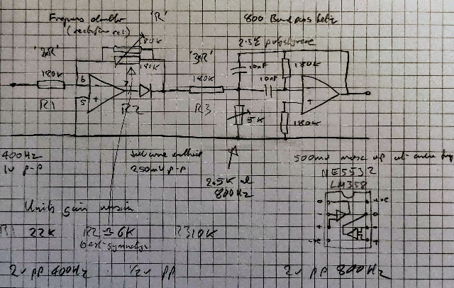
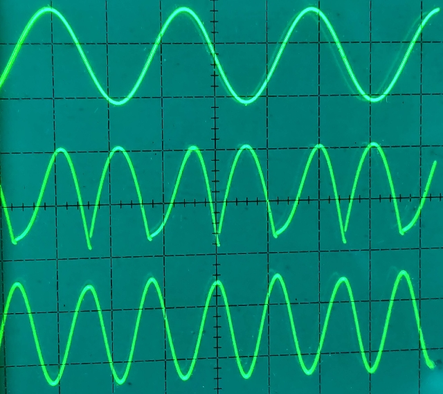

# 400 Hz to 800Hz frequency doubler

This circuit is to be used as a source of 800 Hz to use as a reference for a flux gate synchro. The output is phase locked to the input 400 Hz signal.

The first part of the design is a full wave precision rectifier, this feeds into the second part, a band pass filter centred arund 800Hz to clean up the output waveforem.

The circuit elements are chosen to give approximately unit gain overall. The intermediate full wave rectified signal is about 1/4 of the input and output voltage level.

The first preset is used to adjust the waveform symettry, the second preset is the 800Hz centre frequency, it also changes the phase of the output somewhat.

Initial prototype values are shown on the schematic, final values are shown underneath. The circuit has been tested with input signal of up to 2vpp.

The circuit appears to work better at frequencies below 400Hz but may be adequate for its intended use.
