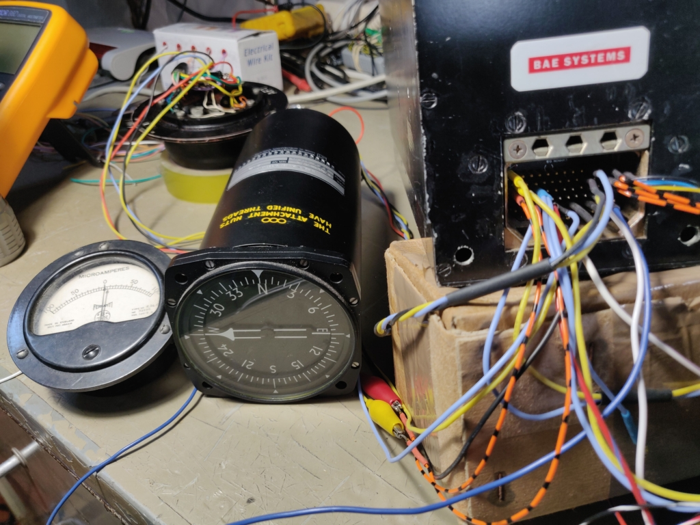
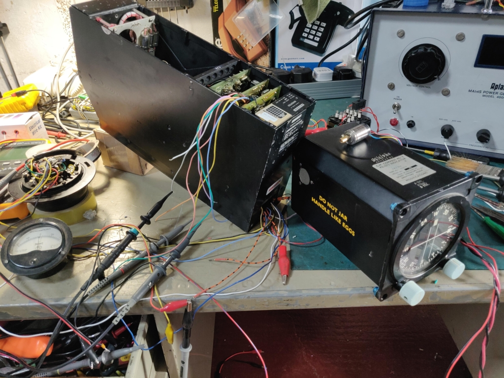
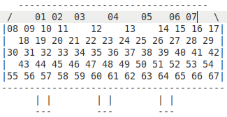

# Compass Computer Mk9

Further investigation and testing after seeing introduction video here: [LDM #281: Compass Computer MK9: teardown, reverse engineering and test](https://www.youtube.com/watch?v=aH1cMq08a5s&t=900s)

## videos

[Video 1](https://youtu.be/iyZRXiceB2g)

[Video 2](https://youtu.be/gscXB2rSLqA)

## Connetions
### Rear panel rectangular connector

### Connection spreadsheet
[Connections 1 ods](./documents/Computer-Compass-Mk9-pinout.ods)

[Connections 1 pdf](./documents/Computer-Compass-Mk9-pinout.pdf)

