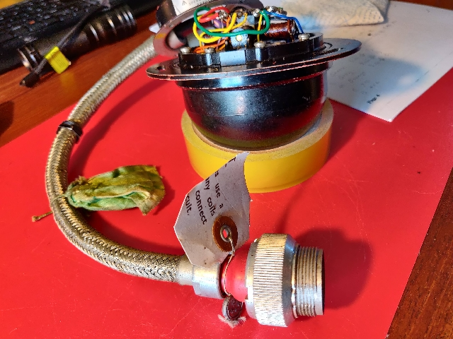
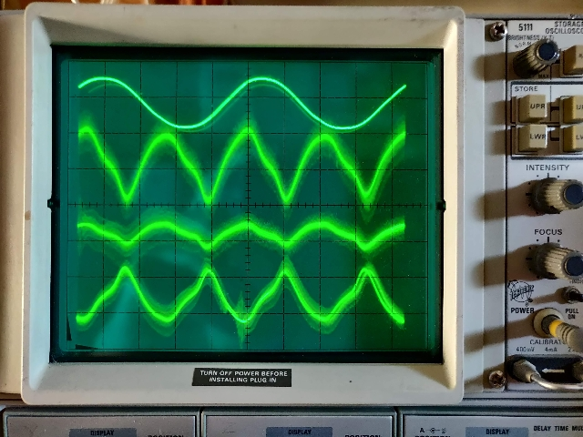
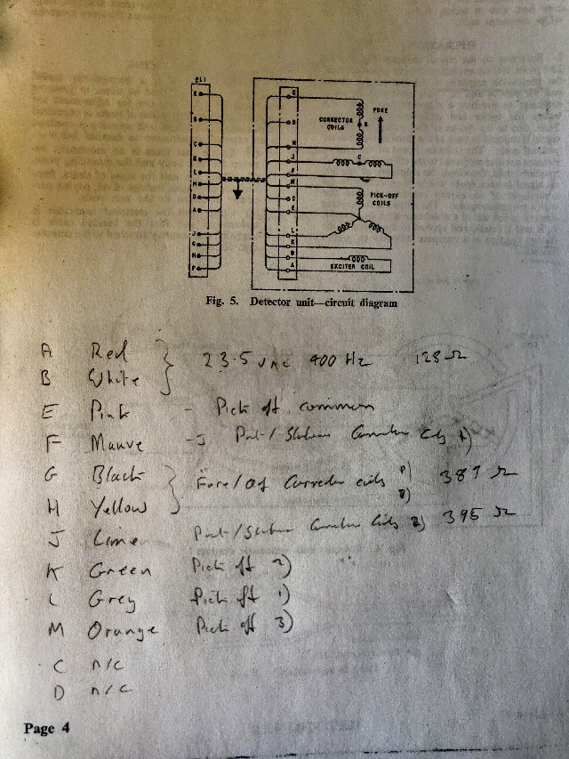
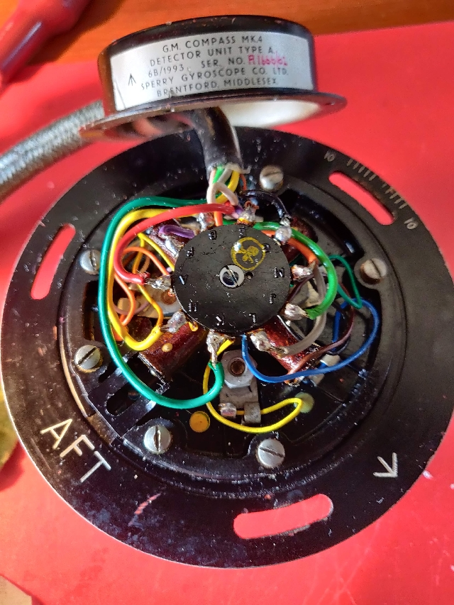
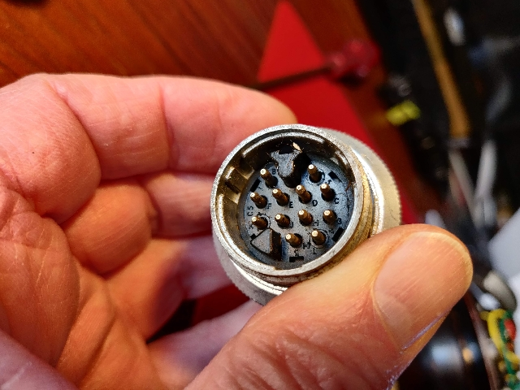

#G.M. COMPASS MK.4

DETECTOR UNIT TYPE A

6B/1993. SER NO. R1666/61

SPERRY GYROSCOPE CO. LTD.

BRENTFORD MIDDLESEX

## Video [Initial test](https://youtube.com/shorts/zsVyMToEcKU)

12 VAC 400Hz excitation

Magnet moving around instrument body

Oscilloscope sensing excitation and each of three pick off coil outputs.

Note 800 Hz signal frequency.

