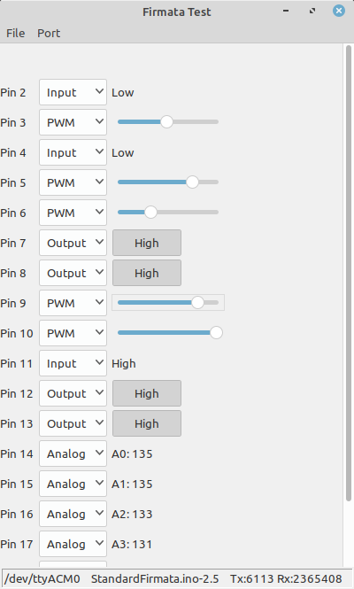

# Analogue and digital drivers for HSI

[HSI Exercise video](https://www.youtube.com/watch?v=QJEtBS4G71U)

The HIS has various display annunciators. These have a range of driving requirements from a few micro amps for the galvanometer gauges to 26 volts for the flag solenoids and panel lamps.

An Arduino running Firmata software is a simple way to develop the required test signals. The galvanomer inputs are driven via current limiting resistors from the 5 volt outputs. The 26 volt outputs are boosted using a high side drive chip TD6283AGP from Toshiba.

A ready made PC program to drive the Arduino Firmata is used. 

The simple on/off galvanometer flags used for NAV and GS flags are driven via 10k resistors from digital outpts.

The centre zero galvanometer outputs are driven from analogue (PWM) outputs but in this case the common is returned to another analogue output preset to 1/2 fsd (2.5v), these outputs are fed through 15k resistors to set the range and limit the current.

The Main flag and DG flag are driven by 26volt solenoid motors, these are fed with digital outpus amplified to 26 volts with the TD2638 driver.

The dial lamps are driven with a PWM signal amplified with the TD2638 giving a lamp dimmer function.

[TD6238AGP](./documents/TD62783AGP.pdf)

[Arduino Firmata](http://firmata.org/wiki/Main_Page)

