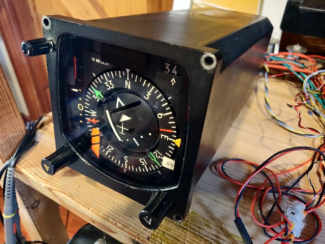
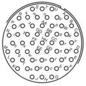
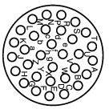

# Smiths Industries Horizontal Situation Indicator

## Connections

|        | Smiths Industries HSI                                   |  |        |                        |
| ------ | ------------------------------------------------------- |-| ------ | ---------------------- |
|        |                                                         |  | 55 pin | function               |
|        |                                                         |  | A      | NAV flag a             |
|        |                                                         |  | B      | ARINC ip a (white)     |
|        |                                                         |  | C      | Chassis b              |
|        |                                                         |  | D      | ARINC ip b (red)       |
|        |                                                         |  | E      |                        |
|        |                                                         |  | F      | DG solenoid +ve        |
|        |                                                         |  | G      | ARINC test ip          |
|        |                                                         |  | H      | n/c                    |
|        |                                                         |  | J      | n/c                    |
|        |                                                         |  | K      | n/c                    |
|        |                                                         |  | L      | n/c                    |
|        |                                                         |  | M      | n/c                    |
|        |                                                         |  | N      | n/c                    |
|        |                                                         |  | P      |                        |
|        |                                                         |  | R      |                        |
|        |                                                         |  | S      | Heading R1             |
|        |                                                         |  | T      | Heading R3             |
|        |                                                         |  | U      | Heading R2             |
|        |                                                         |  | V      | GS galv a              |
|        |                                                         |  | W      | NAV flag b             |
|        |                                                         |  | X      |                        |
|        |                                                         |  | Y      |                        |
| 32 pin | function                                                |  | Z      | Z-high-d               |
| A      | Red-Pointer-a                                           |  | a      | Z-low-d                |
| B      | Red-Pointer-b                                           |  | b      | DG solenoid -ve        |
| C      | Red-Pointer-c                                           |  | c      |                        |
| D      | 115 vac a                                               |  | d      | ? df 0R                |
| E      |                                                         |  | e      | ARINC gnd (black)      |
| F      | Compass-Card-a                                          |  | f      | ? df 809R              |
| G      | Compass-Card-b                                          |  | g      | OP-Bug Y a             |
| H      | n/c                                                     |  | h      | OP-Bug Y b             |
| J      | Z-low-c                                                 |  | I      | n/c                    |
| K      | Green-Pointer-a                                         |  | j      | n/c                    |
| L      | Green-Pointer-b                                         |  | k      | GS galv b              |
| M      | Z-high-a                                                |  | m      | Heading S4             |
| N      | n/c                                                     |  | n      | Heading S1             |
| P      | Rot-Heading G 26v a                                     |  | p      | CD galv a              |
| R      | Rot-Heading G 26v b                                     |  | q      | To-From galv a         |
| S      | Heading R1                                              |  | r      |                        |
| T      |                                                         |  | s      |                        |
| U      | n/c                                                     |  | t      | IP-Heading a           |
| V      | 115 vac b                                               |  | u      | IP-Heading b           |
| W      | Z-low-a                                                 |  | v      | IP-Heading c           |
| X      | Z-high-c                                                |  | w      |                        |
| Y      | Compass-Card-c                                          |  | x      | Main Flag solenoid +ve |
| Z      |                                                         |  | y      | Main Flag solenoid -ve |
| a      | Green-Pointer-c                                         |  | z      | CD galv b              |
| b      |                                                         |  | AA     | Heading S3             |
| c      | Z-low-b                                                 |  | BB     | Heading S2             |
| d      | OP-Heading-b                                            |  | CC     | To-From galv b         |
| e      | OP-Heading-c                                            |  | DD     | Lamps a, 26v DC        |
| f      | Z-high-b                                                |  | EE     | Lamps b, 26v DC        |
| g      | Common-?                                                |  | FF     | Chassis                |
| h      | Chassis-a                                               |  | GG     | GS flag a              |
| j      |                                                         |  | HH     | GS flag b              |
|        |                                                         |  |        |                        |
|        | https://github.com/DavidJRichards/Aviation\_Instruments |  |        |                        |

 

## Tests

## [ARINC Encoder](https://github.com/DavidJRichards/Aviation_ARINC_Encoder/blob/main/README.md)

## [Firmata exercise](./Firmata-exercise.md)

## [Synchro control](./Synchro-control.md)

