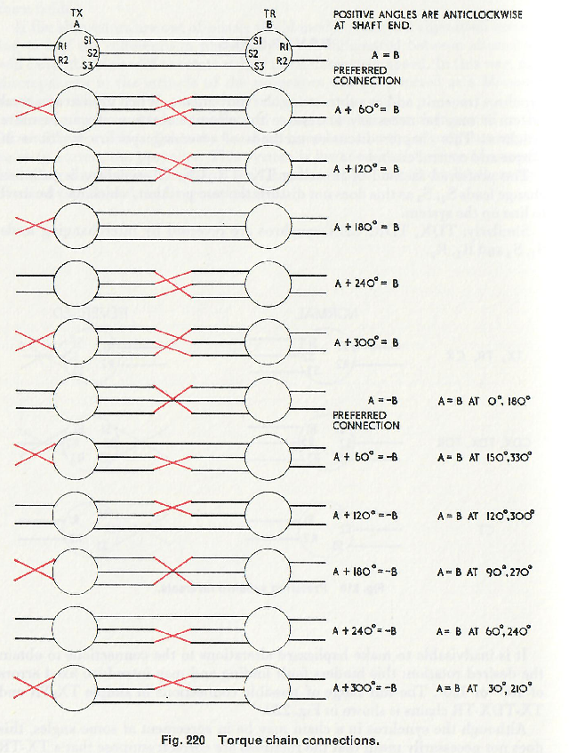

# Aviation_Instruments

## [Horizontal Situation Indicator](https://github.com/DavidJRichards/Aviation_ARINC_Encoder/blob/main/README.md)

## [Firmata exercise](./Firmata-exercise.md)

## [Radio Magnetic Indicator](RMI_PW404.md)

## [Synchro Multiturn Indicator](SMI_SF101.md)

## [Horizon Gyro](Sperry_MK3.md)

