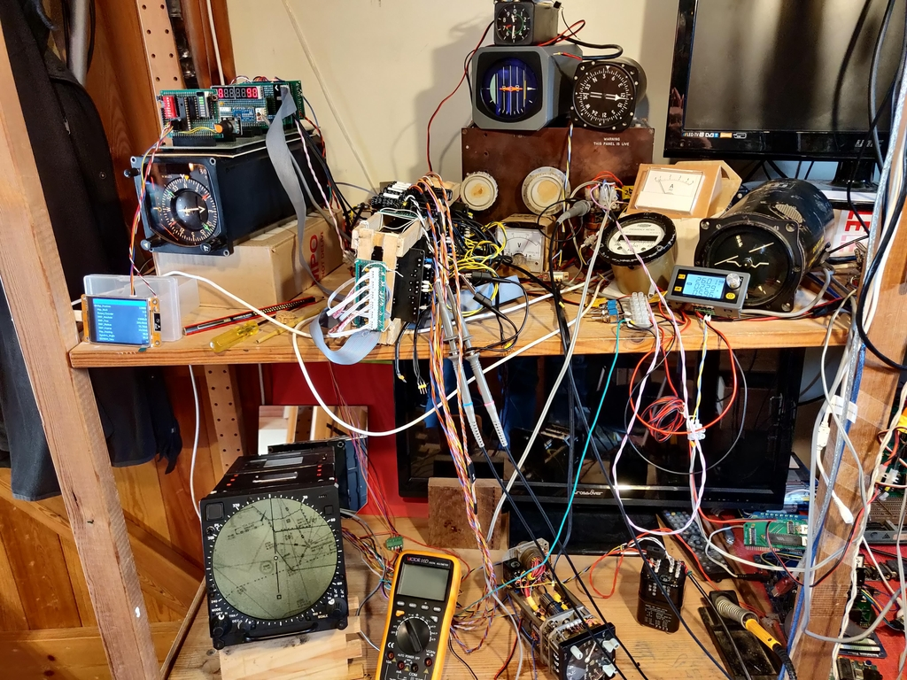

# Aviation_Instruments

## [Ferranti Moving Map Display](https://github.com/DavidJRichards/Aviation_Moving_Map_Display) 

## [Decca Drift angle and Groundspeed indicator](https://github.com/DavidJRichards/Aviation_DriftAngle_GroundSpeed_Indicator)

## [Ferranti Static Inverter](https://github.com/DavidJRichards/Aviation_Static_Inverter) 

## [Leyland Rotary Inverter](https://github.com/DavidJRichards/Aviation_Rotary_Converter) 

## [Smiths Director Horizon H6](https://github.com/DavidJRichards/Aviation_Smiths_Horizon_H6) 

## [Altimeter Encoder](https://github.com/DavidJRichards/Aviation_Altimeter_Encoder/blob/main/README.md)

## [Azimuth Gyro KCA 1903](https://github.com/DavidJRichards/Aviation_Azimuth_Gyro_KCA_1903)

## [Compass Computer](Compass_Computer_Mk3.md)

## [Pilots Indicator](Sperry_Indicator.md)

## [Horizontal Situation Indicator](HSI_WL332.md)

## [Radio Magnetic Indicator](RMI_PW404.md)

## [Synchro Multiturn Indicator](SMI_SF101.md)

## [Horizon Gyro](Sperry_MK3.md)

## [Detector Unit Type A](DetectorUnit_TypeA.md)

## [Fluxgate frequency doubler](400hz-frequency-doubler.md)

## Synchro connections to re-orientate Tx/Rx relationship
[Synchro rotations](./images/rotations.png)
Illustration form 'Synchro Engineering Handbook' by Upson & Batchelor, 1965
