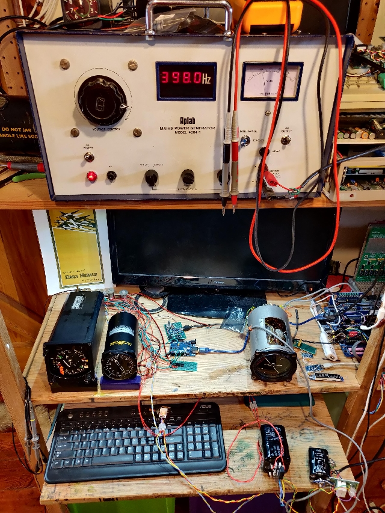

# Aviation_Instruments

## [Horizontal Situation Indicator](HSI_WL332.md)

## [Radio Magnetic Indicator](RMI_PW404.md)

## [Synchro Multiturn Indicator](SMI_SF101.md)

## [Horizon Gyro](Sperry_MK3.md)

## Synchro connections to re-orientate Tx/Rx relationship
[Synchro rotations](./images/rotations.png)
Illustration form 'Synchro Engineering Handbook' by Upson & Batchelor, 1965
