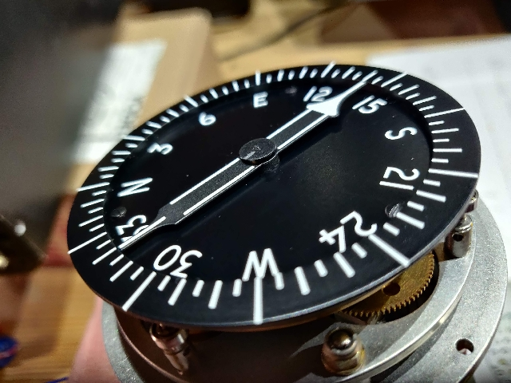
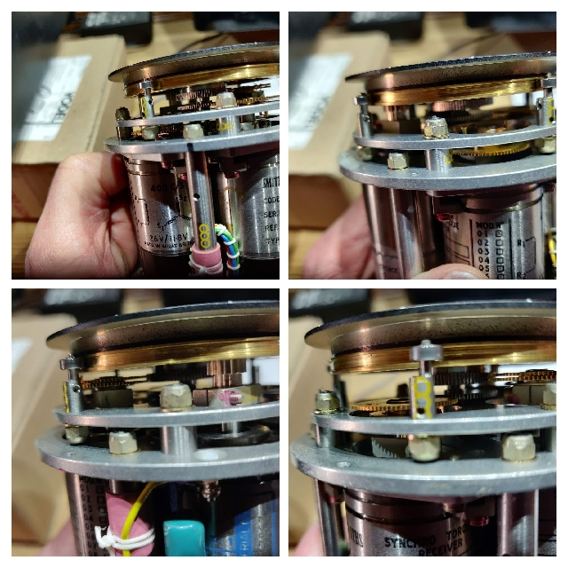

#Smiths Industries, Radio Magnetic Indicator, PW404

## Connector A

|Pin| Function    |
|---|-------------|
| A |26 VAC, 400Hz|
| B |26 VAC, 400Hz|
| C |Card S       |
| D |Card S       |
| E |Card S       |
| F |Chassis      |
| G |n/c          |
| H |n/c          |
| J |n/c          |
| K |n/c          |

The card input is an input to a sevo control amplifier, the output is the compass card background display.

## Connector B

|Pin| Function|
|---|---------|
| A |Heading R|
| B |Heading R|
| C |Heading S|
| D |Heading S|
| E |Heading S|
| F |NoNeedle R|
| G |NoNeedle R|
| H |NoNeedle S|
| J |NoNeedle S|
| K |NoNeedle S|

 

The heading input is connected directly to the heading needle synchro receiver.

Input servo 'NoNeedle' is fully functional except that there is no needle fitted on the display. Close examination shows the centre boss revolving when a synchro signal is applied to the unit. (shown in the photo below with pencil mark on centre boss)

