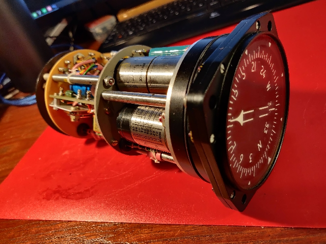

#Smiths Industries, Radio Magnetic Indicator, PW404

 

## Connector A

|Pin| Function    |
|---|-------------|
| A |26 VAC, 400Hz|
| B |26 VAC, 400Hz|
| C |Card S       |
| D |Card S       |
| E |Card S       |
| F |Chassis      |
| G |n/c          |
| H |n/c          |
| J |n/c          |
| K |n/c          |

## Connector B

|Pin| Function|
|---|---------|
| A |Heading R|
| B |Heading R|
| C |Heading S|
| D |Heading S|
| E |Heading S|
| F |Unknown R|
| G |Unknown R|
| H |Unknown S|
| J |Unknown S|
| K |Unknown S|

