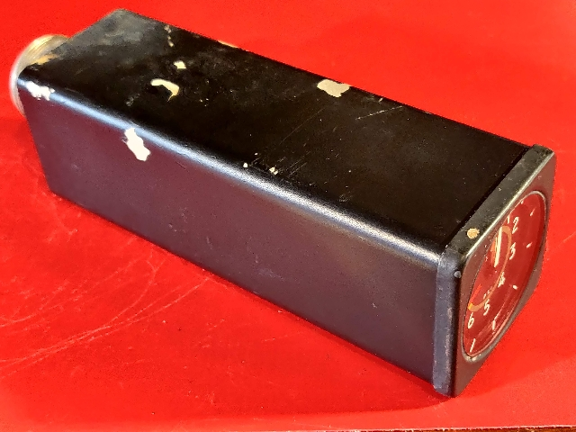

# Smiths, Synchro Multiturn Indicator, PSI

|Pin|Function   |
|---|-----------|
|A  |           |
|B  |           |
|C  |624R to D&E|
|D  |624R to C&E|
|E  |624R to C&D|
|F  |           |
|G  |           |
|H  |           |
|I  |           |
|J  |           |
|K  |           |
|L  |           |
|M  |           |
|N  |           |

