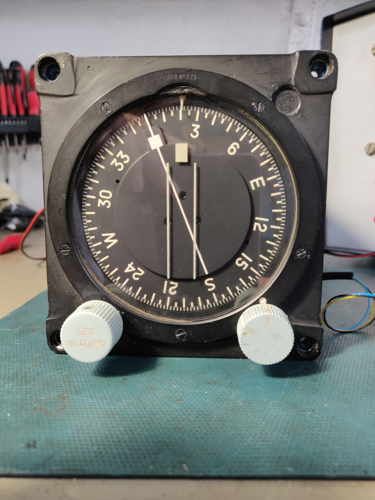
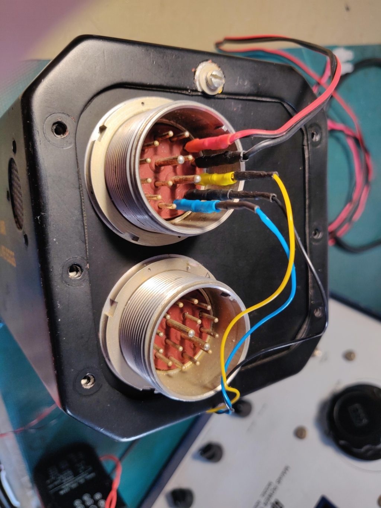
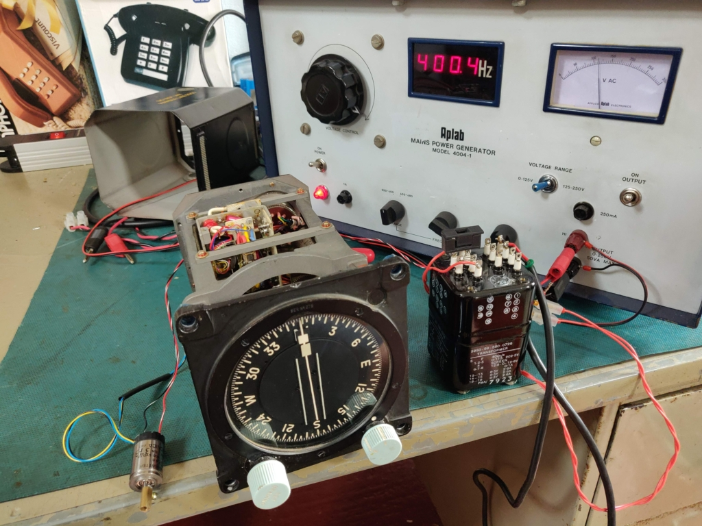
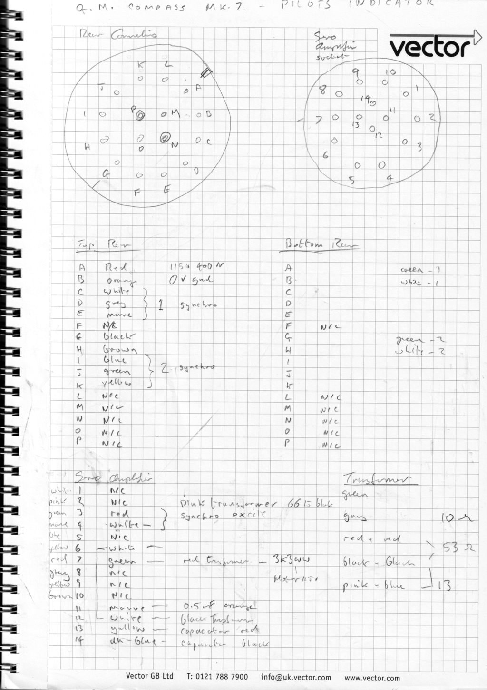
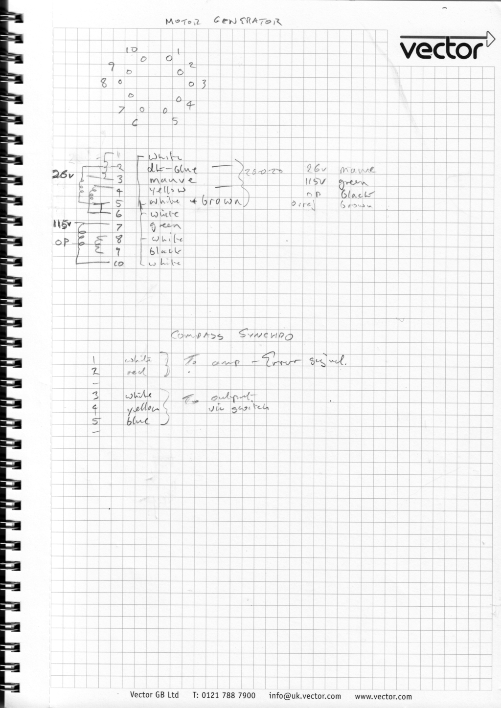

# G.M. Compass Indicator Mk.7
## PILOTS INDICATOR
## 6 B / 3527
## Part No. 19562-0
## Made in England by
## SPERRY GYROSCOPE Co Ltd```

[Synchro test video](https://youtu.be/fLiG7KYmrzQ)












