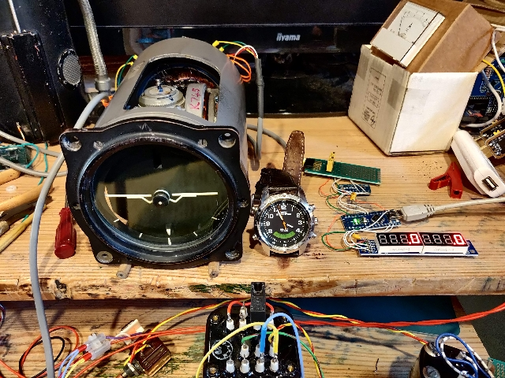
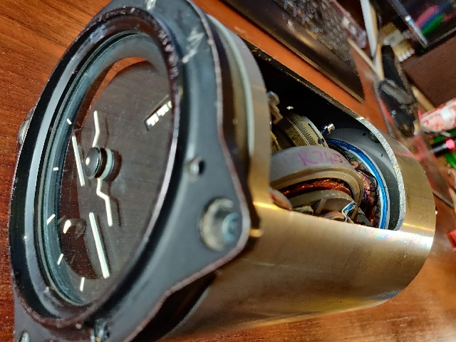
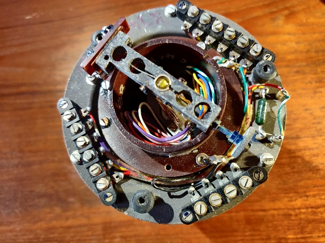

# Sperry Horizon Gyro MK3



[Automatic erection tests video](https://youtu.be/8H-Tmcy6JmU)





[Sperry startup video](https://youtu.be/WSG6-UwckAI)


## Roll & Pitch display


```cpp
/*  File:    Gyro_pitch_roll_display, based on:
 *  and ads1115 library
 *  https://wolles-elektronikkiste.de/en/ads1115-a-d-converter-with-amplifier (English)
 *  FILE:    HCMODU0082_Serial_7_Segment_Module_Example2
   DATE:    25 March 2022
   VERSION: Initial

PINOUT:
MODULE.....UNO/NANO.....MEGA
VCC........+5V..........+5V
GND........GND..........GND
MAX7219 power Vin (5v)
DIN........11...........51
CS (LOAD)..10...........10
CLK........13...........52
ADS1115 power/reference 3V3
SCL         4
SDA         5
*/

#include <HCMAX7219.h>
#include "SPI.h"
#include<ADS1115_WE.h>
#include<Wire.h>
#define I2C_ADDRESS 0x48
#define GYRO_POT_FACTOR 580
#define GYRO_POT_FACTOR_PITCH GYRO_POT_FACTOR
#define GYRO_POT_FACTOR_ROLL  GYRO_POT_FACTOR
/* Set the LOAD (CS) digital pin number*/
#define LOAD 10

/* Create an instance of the library */
ADS1115_WE adc = ADS1115_WE(I2C_ADDRESS);
HCMAX7219 HCMAX7219(LOAD);

void setup()
{
  Wire.begin();
  Serial.begin(115200);
  Serial.println("Horizon Gyro, Mk3");
  if(!adc.init())
  {
    Serial.println("ADS1115 not connected!");
  }
  HCMAX7219.Clear();
}

float readChannel(ADS1115_MUX channel)
{
  float voltage = 0.0;
  adc.setCompareChannels(channel);
  adc.setVoltageRange_mV(ADS1115_RANGE_4096);
  adc.startSingleMeasurement();
  while(adc.isBusy()){}
  voltage = adc.getResult_V();
  return voltage;
}

/* Main program */
void loop()
{
  char dispbuf[12];
  float voltage_0_1 = 12.3;
  float voltage_2_3 = 56.7;

  voltage_0_1 = readChannel(ADS1115_COMP_0_1);
  voltage_2_3 = readChannel(ADS1115_COMP_2_3);
  // print7seg function doctored to add DPs to string
  sprintf(dispbuf,"%4d%4d",int(voltage_0_1*GYRO_POT_FACTOR_PITCH),int(voltage_2_3*GYRO_POT_FACTOR_ROLL));

#if 1
  Serial.print("Pitch=");
  Serial.print(voltage_0_1);
  Serial.print(",\t Roll=");
  Serial.println(voltage_2_3);
#endif

    HCMAX7219.Clear();
    HCMAX7219.print7Seg(dispbuf,8);
    HCMAX7219.Refresh();
    delay(250);
}
```

[Pitch and roll display test video](https://youtu.be/-9xZsgO8oiw)