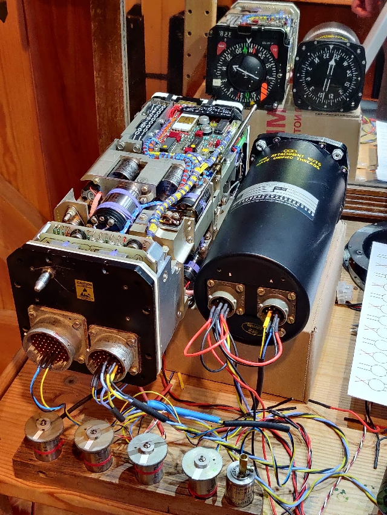
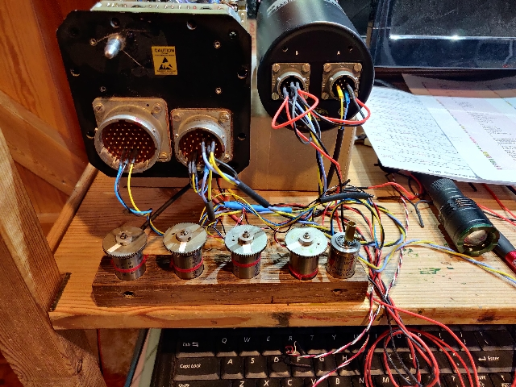

# Synchro control

## HSI & RMI syschro tests

Video: [HSI to RMI connection, with course knob adjustment](https://youtu.be/zjzLrkiWidM)

Video: [HSI course input connected to synchro transmitter (Course pointer)](https://youtu.be/Rsa7xZeP0iU)

The videos show that when an iput from a synchro transmitter is connected to the Course input then the Course knob ceases to work as before when no Course synchro is attached. 

I dont really understand if this is correct or if the input is meant to be used like this.

For [connections](./HSI_WL332.md) see here.

